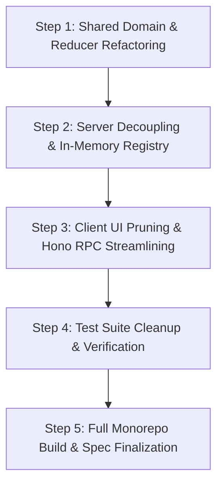

# Test Suite & Migration Strategy

Type: task
Status: resolved
Blocked by: 02, 04

## Question

What is the end-to-end testing and verification plan across `shared/`, `server/`, and `client/` to validate:
1. Pure in-memory room lifecycle without Docker or PostgreSQL running
2. Zero-auth reconnects and participant presence handling
3. Server-enforced Reveal Gate privacy invariant (votes remain concealed from non-facilitator payloads until reveal)
4. Manual story backlog reordering and multi-round estimation flow?

## Answer

### 1. Test Suite Architecture Across 3 Workspaces

The testing architecture uses **Vitest** in a monorepo workspace configuration (`vitest.workspace.ts`). All tests execute in-process without requiring Docker, PostgreSQL, Redis, or internet access.

```
├── shared/src/__tests__/
│   ├── room-reducer.test.ts    # 16 pure reducer actions & state machine invariants
│   ├── reveal-gate.test.ts     # Vote masking, consensus calculation & outlier detection
│   └── schemas.test.ts         # Zod validation schemas for all REST request bodies
├── server/src/__tests__/
│   ├── server.test.ts          # End-to-end Hono REST endpoint integration tests
│   ├── registry.test.ts        # In-memory RoomRegistry, TTL sweeper, and failover
│   └── sse-events.test.ts      # Server-Sent Events stream initialization & broadcasts
└── client/src/__tests__/
    ├── session.test.ts         # LocalStorage session profile persistence
    ├── useRoomSocket.test.ts   # SSE event handling, auto-rejoin & typed RPC actions
    ├── PokerTableArena.test.tsx# 4-phase table rendering & dynamic seat positioning
    ├── DeckSelector.test.tsx   # Dynamic card scale rendering, selection & retraction
    ├── BacklogDrawer.test.tsx  # In-room story CRUD, queue reorder & MD/CSV export
    └── FacilitatorBar.test.tsx # Role-gated facilitator controls & revote/finalize flows
```

---

### 2. Four Core Test Scenarios & Invariant Verification

#### A. In-Memory Room Lifecycle & Zero-Infrastructure
- **Validation**:
  - `POST /api/rooms` creates a `RoomActor` in `RoomRegistry` without database connections.
  - Rooms are addressable via canonical `slug` (e.g. `swift-badger-42`) or 6-char `short_code` (e.g. `SWB-42`).
  - Rooms idle for > 4 hours without active SSE subscribers are automatically purged by the registry sweep timer.
  - Server starts with zero environment variables required (`PORT` defaults to 3000).

#### B. Zero-Auth Reconnects & Participant Presence
- **Validation**:
  - First joining participant is automatically designated `Facilitator` (`facilitator_id = pid`). Subsequent joiners default to `Estimator` (or `Observer`).
  - Stored `participant_id` in browser `localStorage` allows instant re-connection without losing participant identity or cast votes.
  - When a participant's SSE stream closes, `connected` is set to `false` and broadcast to the room.
  - If the Facilitator disconnects, a 5-minute failover timer starts; if no reconnect occurs, Facilitator privileges transfer to the next connected Estimator.

#### C. Server-Enforced Reveal Gate Privacy Invariant
- **Validation**:
  - In `Idle` and `Voting` phases, all GET requests and SSE `room_state` events return `vote: null` for all other estimators. Each estimator only sees their own vote and `has_voted: boolean` flags for peers.
  - `consensus` is strictly `null` until cards are revealed.
  - In `Revealed` and `Finalized` phases, all votes are unmasked, and statistical consensus metrics (`consensus_pct`, `mode`, `min_vote`, `max_vote`, `category`) are populated.
  - Any vote attempt after `reveal` returns `400 Bad Request`.

#### D. Manual Story Backlog & Multi-Round Estimation
- **Validation**:
  - Stories can be added to backlog (`ADD_STORY`), edited (`UPDATE_STORY`), deleted (`REMOVE_STORY`), and reordered (`REORDER_BACKLOG`).
  - `REORDER_BACKLOG` validates that the supplied `story_ids` array is a strict permutation of existing backlog IDs; invalid requests are rejected.
  - Facilitator advancing via `NEXT_STORY` shifts the head story to `current_story`, resets the round to `Idle`, clears all votes and consensus, and broadcasts the reset state.

---

### 3. Step-by-Step Migration & Refactoring Execution Plan



1. **Step 1: Shared Domain & Schemas Refactoring (`packages/shared`)**:
   - Prune `domain.ts` to 4 phases (`Idle`, `Voting`, `Revealed`, `Finalized`), lean `Participant`, lean `Story`, and first-class `DeckConfig`.
   - Update `room-reducer.ts` to 16 canonical actions.
   - Refactor `reveal-gate.ts` for dynamic deck consensus and state masking.
   - Prune `schemas.ts` of all AI and tracker schemas.
   - Run `npm run test -w shared` to ensure 100% pass.

2. **Step 2: Server In-Memory Decoupling (`packages/server`)**:
   - Delete `server/src/db/` directory (`index.ts`, `schema.ts`, `migrate.ts`, `seed.ts`).
   - Delete `server/src/ai/` directory (`gemini-client.ts`) and `server/src/routes/ai.ts`.
   - Update `server/src/room/room-actor.ts` and `registry.ts` to pure in-memory with 4-hour TTL sweeper.
   - Streamline `server/src/routes/rooms.ts` and `routes/events.ts`.
   - Remove `drizzle-orm`, `drizzle-kit`, `postgres`, `@google/genai` from `server/package.json`.
   - Run `npm run test -w server`.

3. **Step 3: Client UI Pruning & Hook Refactoring (`packages/client`)**:
   - Delete 4 obsolete modal components (`StoryDoctorPanel.tsx`, `ConnectTrackerModal.tsx`, `SPIDRSliceModal.tsx`, `PointReferenceLibrary.tsx`) and obsolete tests.
   - Update `RoomView.tsx` to single-column layout.
   - Add `DeckConfigModal.tsx` and enhance `DeckSelector.tsx` for dynamic decks.
   - Enhance `BacklogDrawer.tsx` for manual story management and exports.
   - Streamline `useRoomSocket.ts` to typed Hono RPC actions.
   - Run `npm run test -w client`.

4. **Step 4: Monorepo Build & Comprehensive Verification**:
   - Run `npm run build` across all workspaces.
   - Run `npm test` across all 3 workspaces.
